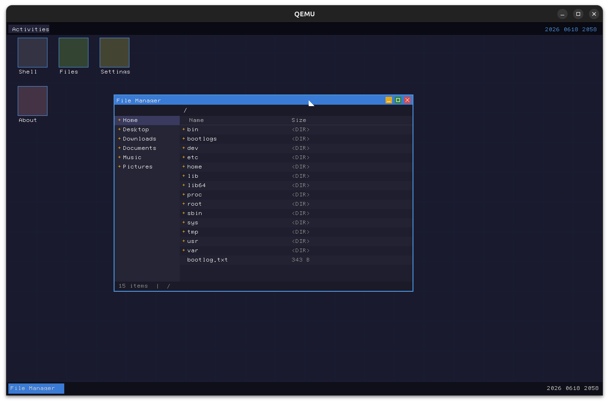

# Fullerene

---



[development_history](docs/history)

[Discord Community](https://discord.gg/FfAbRaUA26)
The community is still new, but we welcome you!

---

Fullerene is a complete operating system kernel written in Rust, targeting x86_64 architecture with UEFI booting. It explores modern systems programming concepts including process scheduling, virtual memory management, filesystem abstraction, syscall interfaces, GUI compositing, and event-driven shell interaction, all implemented in a safe, no_std environment.

Fullerene provides a full-featured kernel with multitasking capabilities, running in QEMU virtual machine. The system includes a bootloader, kernel scheduler, process management, memory allocation, device drivers, GUI windowing system, interactive shell, and user-space support scaffolding.

## Features

- **UEFI Bootloader (Bellows)**: A no_std UEFI application that loads the kernel ELF, initializes framebuffer graphics via Graphics Output Protocol (GOP), sets up custom configuration tables, and transitions to kernel execution after exiting boot services.

- **Full-Featured Kernel (Fullerene-Kernel)** with components including:
  - **Memory Management**: Virtual memory with page tables, heap allocation (linked-list allocator), and physical memory tracking
  - **Process Management**: Full process creation, scheduling, and context switching capabilities
  - **Scheduler**: Preemptive round-robin scheduler with interrupt-driven task switching
  - **Syscall Interface**: Complete system call implementation for user-kernel communication
  - **Filesystem**: Abstraction layer for file operations (currently in-memory implementation)
  - **GUI Windowing System**: Lattice-based compositor, desktop, window management, and font rendering with cursor blink and terminal surface
  - **Hardware Interfaces**: Keyboard input, serial output, APIC/PIC interrupt handling, VirtIO-GPU support
  - **Shell**: Nozzle-based interactive shell with line editing, command history, and extensible built-in commands

- **GUI Framework (Lattice)**: A no_std compositing window system providing desktop environment, window manager, scene graph, surface rendering, terminal surface with bitmap font, and cursor support.

- **Event System (Resonance)**: A no_std event-driven framework with dispatcher, event queue, event sources, and typed event handlers for decoupled component communication.

- **Time Management (Chronoline)**: A no_std timer management primitive with deadline tracking, tick-based clock advancement, and sorted timer event queue for scheduler integration.

- **Shell Runtime (Nozzle)**: A no_std interactive shell runtime providing line editor with history, command parser, extensible command interface, prompt, and terminal abstraction. Used by the kernel's shell and accessible via both serial and GUI terminal.

- **Hardware Abstraction Layer (Nitrogen)**: Driver and hardware abstraction library providing PCI enumeration, APIC/PIC interrupt controllers, PS/2 keyboard/mouse, HDA audio, VirtIO block/net/gpu, USB XHCI, NVMe/AHCI storage, iwlwifi, and framebuffer management.

- **Application Framework (Solvent)**: File explorer, image/audio viewers, menu actions, and handler infrastructure for building user-facing applications on Lattice and Nozzle.

- **Common Library (Petroleum)**: Shared no_std utilities for UEFI types, serial logging, memory operations, graphics primitives, bare-metal hardware detection, page table management, and VirtIO device drivers.

- **Build System (Flasks)**: Automated task runner for building bootloader and kernel, ISO creation (using isobemak crate), and QEMU virtualization with configurable VGA and display backends.

- **Userland Placeholder (Toluene)**: Scaffolding for user-space programs in Rust (currently minimal).

The system boots from UEFI firmware, initializes all hardware interfaces, and runs a kernel scheduler that manages multiple processes concurrently. User interaction occurs through a GUI terminal or serial shell interface, with full debugging support via serial logging.

## Quick Start

```bash
cargo run -q -p flasks -- --vga std
```

For detailed build instructions, QEMU options, and manual build steps, see [docs/BUILD.md](docs/BUILD.md).

## Documentation

| Document | Description |
|----------|-------------|
| [docs/BUILD.md](docs/BUILD.md) | Prerequisites, build instructions, QEMU options, manual build steps |
| [docs/WORKSPACE.md](docs/WORKSPACE.md) | Cargo workspace structure and crate descriptions |
| [docs/HARDWARE.md](docs/HARDWARE.md) | Real hardware compatibility notes |
| [docs/DEVELOPMENT.md](docs/DEVELOPMENT.md) | Toolchain, testing, debugging, and development guidelines |
| [docs/ARCHITECTURE.md](docs/ARCHITECTURE.md) | Architecture overview |

## TODO / Next Steps

- **Boot Experience**: Boot splash screen with logo, progress indicator, and fade transition to desktop.
- **Graphics / Compositor**: vsync support, BDF font importer, font compiler via build.rs.
- **Storage**: Block cache, FAT32 filesystem, initramfs support.
- **Input**: USB HID driver, keyboard hotplug, mouse hotplug.
- **Userspace**: ELF loader, process abstraction, syscall layer, userspace memory isolation, user-facing applications (settings, task monitor, file browser, log viewer).
- **Developer Experience**: CI integration, build time measurement, debug feature flags, nightly regression testing, architecture documentation (Graphics.md, Memory.md, Boot.md, etc.).
- **Stretch Goals**: Network stack, audio output, Wayland-style compositor, SMP support, Rust userspace SDK, package manager, self-hosted build.

See issues on GitHub for tracked tasks. For a detailed checklist, refer to [docs/fullerene_todo.md](docs/fullerene_todo.md).

## Contributing

Bug reports, feature suggestions, and pull requests are welcome. Please see [CONTRIBUTING.md](docs/CONTRIBUTING.md) for guidelines on submitting contributions.

- Fork the repo and create a feature branch.
- Ensure tests pass and the build runs in QEMU.
- Submit a PR with detailed description.

## License

This project is licensed under either of:

- [Apache License, Version 2.0](docs/LICENSE-APACHE)
- [MIT License](docs/LICENSE-MIT)

at your option.

### Contribution Requirements

Unless you explicitly state otherwise, any contribution intentionally submitted for inclusion in Fullerene by you shall be dual-licensed as above, without any additional terms or conditions.