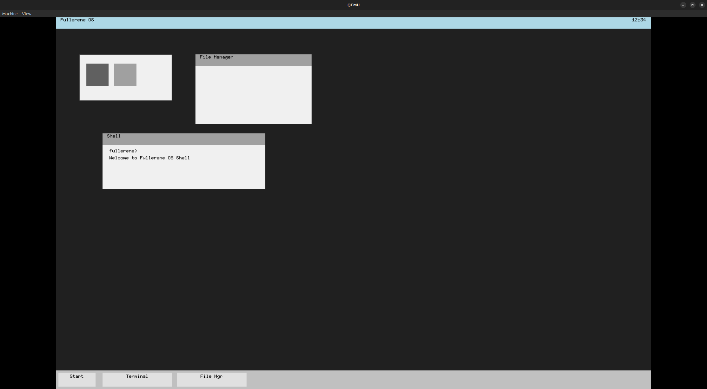

# Fullerene

---



[development_history](docs/history)

[Discord Community](https://discord.gg/FfAbRaUA26)
The community is still new, but we welcome you!

---

Fullerene is a complete operating system kernel written in Rust, targeting x86_64 architecture with UEFI booting. It explores modern systems programming concepts including process scheduling, virtual memory management, filesystem abstraction, syscall interfaces, GUI compositing, and event-driven shell interaction, all implemented in a safe, no_std environment.

Fullerene provides a full-featured kernel with multitasking capabilities, running in QEMU virtual machine. The system includes a bootloader, kernel scheduler, process management, memory allocation, device drivers, GUI windowing system, interactive shell, and user-space support scaffolding.

## Features

- **UEFI Bootloader (Bellows)**: A no_std UEFI application that loads the kernel ELF, initializes framebuffer graphics via Graphics Output Protocol (GOP), sets up custom configuration tables, and transitions to kernel execution after exiting boot services.

- **Full-Featured Kernel (Fullerene-Kernel)** with components including:
  - **Memory Management**: Virtual memory with page tables, heap allocation (linked-list allocator), and physical memory tracking
  - **Process Management**: Full process creation, scheduling, and context switching capabilities
  - **Scheduler**: Preemptive round-robin scheduler with interrupt-driven task switching
  - **Syscall Interface**: Complete system call implementation for user-kernel communication
  - **Filesystem**: Abstraction layer for file operations (currently in-memory implementation)
  - **GUI Windowing System**: Lattice-based compositor, desktop, window management, and font rendering with cursor blink and terminal surface
  - **Hardware Interfaces**: Keyboard input, serial output, APIC/PIC interrupt handling, VirtIO-GPU support
  - **Shell**: Nozzle-based interactive shell with line editing, command history, and extensible built-in commands

- **GUI Framework (Lattice)**: A no_std compositing window system providing desktop environment, window manager, scene graph, surface rendering, terminal surface with bitmap font, and cursor support.

- **Event System (Resonance)**: A no_std event-driven framework with dispatcher, event queue, event sources, and typed event handlers for decoupled component communication.

- **Time Management (Chronoline)**: A no_std timer management primitive with deadline tracking, tick-based clock advancement, and sorted timer event queue for scheduler integration.

- **Shell Runtime (Nozzle)**: A no_std interactive shell runtime providing line editor with history, command parser, extensible command interface, prompt, and terminal abstraction. Used by the kernel's shell and accessible via both serial and GUI terminal.

- **Common Library (Petroleum)**: Shared no_std utilities for UEFI types, serial logging, memory operations, graphics primitives, bare-metal hardware detection, page table management, and VirtIO device drivers.

- **Build System (Flasks)**: Automated task runner for building bootloader and kernel, ISO creation (using isobemak crate), and QEMU virtualization with configurable VGA and display backends.

- **Userland Placeholder (Toluene)**: Scaffolding for user-space programs in Rust (currently minimal).

The system boots from UEFI firmware, initializes all hardware interfaces, and runs a kernel scheduler that manages multiple processes concurrently. User interaction occurs through a GUI terminal or serial shell interface, with full debugging support via serial logging.

## Workspace Structure

The project is structured as a Cargo workspace with the following crates:

- **`bellows`**: The UEFI bootloader. Responsible for loading the kernel and setting up the framebuffer configuration.
- **`fullerene-kernel`**: The core kernel. Handles low-level hardware initialization, process scheduling, and enters the main shell loop.
- **`flasks`**: The build and task runner. Builds the kernel and bootloader, creates a bootable ISO, and launches QEMU for emulation.
- **`lattice`**: A no_std GUI framework providing compositing window system, desktop, window manager, scene graph, and terminal surface rendering.
- **`nozzle`**: A no_std interactive shell runtime with line editor, history, command dispatch, and terminal abstraction.
- **`resonance`**: A no_std event system with dispatcher, event queue, event sources, and typed event handlers.
- **`chronoline`**: A no_std timer management primitive for deadline tracking and timer scheduling.
- **`petroleum`**: A library providing common EFI types, utilities, serial output macros, graphics primitives, page table management, and VirtIO drivers for no_std environments.
- **`toluene`**: Placeholder for userland components (e.g., user-space binaries). Currently minimal.

## Building and Running

### Prerequisites

- Rust nightly toolchain (required for no_std and UEFI targets): Install via `rustup toolchain install nightly`.
- QEMU: Install on Linux/macOS via package manager (e.g., `apt install qemu-system-x86` on Ubuntu).
- OVMF (UEFI firmware): Included in `flasks/ovmf/` (RELEASEX64 files). If missing, run with `--clone-ovmf` to copy from system installation or download from [TianoCore releases](https://github.com/tianocore/edk2/releases).

### Build and Run

Run the task runner, which handles building, ISO creation, and QEMU emulation:

```bash
cargo run --bin flasks
```

This command:
1. Builds `fullerene-kernel` and `bellows` for the UEFI target with `x86_64-unknown-uefi`.
2. Creates a FAT image and ISO (`fullerene.iso`) with the bootloader and kernel.
3. Launches QEMU with:
   - 4GB RAM.
   - VirtIO-GPU with GTK display (1024x768 default resolution).
   - Serial output to stdout (for logs).
   - OVMF firmware for UEFI booting.
   - Boot from the ISO.

### QEMU Options

Flasks supports dynamic VGA/display configuration via CLI arguments:

| Argument | Default | Description |
|----------|---------|-------------|
| `--vga <type>` | `virtio-gpu` | VGA device: `virtio-gpu`, `std`, `qxl`, `cirrus`, `none` |
| `--display <backend>` | `gtk` | Display backend: `gtk`, `sdl`, `none`, `curses` |
| `--resolution <WxH>` | `1024x768` | Screen resolution (virtio-gpu/qxl only) |
| `--headless` | false | Run QEMU in headless mode (no GUI) |
| `--timeout <seconds>` | none | Timeout for QEMU execution in seconds |
| `--clone-ovmf` | false | Copy OVMF binaries from system installation to project |

Examples:
```bash
# std-vga (Bochs VBE) for framebuffer debugging
cargo run --bin flasks -- --vga std

# QXL with SDL backend
cargo run --bin flasks -- --vga qxl --display sdl

# Headless mode (serial only, no GUI)
cargo run --bin flasks -- --display none

# Custom resolution with virtio-gpu
cargo run --bin flasks -- --resolution 1280x720

# Run with a timeout
cargo run --bin flasks -- --timeout 30
```

Expected output:
- Serial logs from bootloader: Heap init, GOP init, kernel load.
- VGA/graphics framebuffer initialization and Lattice compositor startup.
- Shell interface becomes available after scheduler starts running processes (via GUI terminal or serial).
- System runs multi-tasking kernel with shell interaction available.

To debug:
- QEMU logs are written to `qemu_log.txt` (interrupts and other debug info).
- Use `RUST_LOG=debug cargo run --bin flasks` for more verbose output.

For release builds, modify `flasks/src/main.rs` to use `--profile release` or run `cargo build --release`.

### Manual Build Steps

For manual building without the task runner:

1. Build bootloader:
   ```bash
   cargo +nightly build -Zbuild-std=core,alloc --package bellows --target x86_64-unknown-uefi
   ```

2. Build kernel (repeat for updated kernel binary):
   ```bash
   cargo +nightly build -Zbuild-std=core,alloc --package fullerene-kernel --target x86_64-unknown-uefi
   ```

3. Create ISO: The build process copies the kernel binary into the bootloader, then creates a UEFI-bootable ISO using tools like `isobemak`.

4. Run in QEMU:
   ```bash
   qemu-system-x86_64 \
     -m 4G \
     -cpu qemu64,+smap,-invtsc \
     -smp 1 \
     -M q35 \
     -vga none \
     -device virtio-gpu-pci,disable-legacy=on,disable-modern=off,xres=1024,yres=768 \
     -display gtk,gl=off,window-close=on,zoom-to-fit=on \
     -serial stdio \
     -accel tcg,thread=single \
     -d int,cpu_reset,guest_errors,unimp \
     -D qemu_log.txt \
     -monitor none \
     -drive if=pflash,format=raw,unit=0,readonly=on,file=flasks/ovmf/RELEASEX64_OVMF_CODE.fd \
     -drive if=pflash,format=raw,unit=1,file=flasks/ovmf/RELEASEX64_OVMF_VARS.fd \
     -drive file=fullerene.iso,media=cdrom,if=ide,format=raw \
     -no-reboot \
     -no-shutdown \
     -device isa-debug-exit,iobase=0xf4,iosize=0x04 \
     -rtc base=utc \
     -boot menu=on,order=d \
     -nodefaults
   ```

## Real Hardware Compatibility

### InsydeH2O Firmware (June 2026)

Running on real hardware with InsydeH2O UEFI firmware required three fixes:

1. **Do not call `SetMode()`**: InsydeH2O's GOP implementation changes `frame_buffer_base` and/or invalidates `pixels_per_scan_line` after `SetMode()`, causing "backlight only" (no display output). The bootloader now uses the current mode as-is.

2. **BGR/RGB byte-order in `rgb888_to_pixel_format()`**: The color conversion function had its byte-order arguments reversed for BGR vs RGB pixel formats. For BGR hardware (common on Intel GOP), `rgb_pixel(r,g,b)` produces the correct LE memory layout `[b,g,r,0]` which BGR interprets as B=b, G=g, R=r. The fix corrects the mapping: BGR/PixelBitMask formats use `rgb_pixel(r,g,b)` while RGB formats use `rgb_pixel(b,g,r)`.

3. **Skip `safe_map_page` WC remap on real hardware**: The kernel's `safe_map_page` (via `map_page_4k_l1`) attempts to split the boot-phase 2MB/1GB huge-page WB mapping into 4KB WC pages for the framebuffer. On InsydeH2O this operation breaks the mapping entirely, making the framebuffer inaccessible. The fix relies on the existing boot-phase huge-page identity mapping (WB via PAT/MTRR), which is already functional and confirmed working via direct `write_volatile` tests.

## Development

- **Toolchain**: Use `rust-toolchain.toml` for pinning nightly.
- **Panic Policy**: Aborts in dev/release for no_std compatibility.
- **Memory Allocation**: Uses `linked_list_allocator` for heap management with frame allocation tracking.
- **Testing**: Run unit tests with `cargo test` for libraries (chronoline, resonance, nozzle, lattice, petroleum have tests). For kernel tests, run in QEMU as above.
- **Debugging**: Use serial output and QEMU logging. For GDB debugging, enable QEMU GDB stub with `-s -S`.

## TODO / Next Steps

- **Boot Experience**: Boot splash screen with logo, progress indicator, and fade transition to desktop.
- **Graphics / Compositor**: vsync support, BDF font importer, font compiler via build.rs.
- **Storage**: Block cache, FAT32 filesystem, initramfs support.
- **Input**: USB HID driver, keyboard hotplug, mouse hotplug.
- **Userspace**: ELF loader, process abstraction, syscall layer, userspace memory isolation, user-facing applications (settings, task monitor, file browser, log viewer).
- **Developer Experience**: CI integration, build time measurement, debug feature flags, nightly regression testing, architecture documentation (Graphics.md, Memory.md, Boot.md, etc.).
- **Stretch Goals**: Network stack, audio output, Wayland-style compositor, SMP support, Rust userspace SDK, package manager, self-hosted build.

See issues on GitHub for tracked tasks. For a detailed checklist, refer to [docs/fullerene_todo.md](docs/fullerene_todo.md).

## Contributing

Bug reports, feature suggestions, and pull requests are welcome. Please see [CONTRIBUTING.md](docs/CONTRIBUTING.md) for guidelines on submitting contributions.

- Fork the repo and create a feature branch.
- Ensure tests pass and the build runs in QEMU.
- Submit a PR with detailed description.

## License

This project is licensed under either of:

- [Apache License, Version 2.0](docs/LICENSE-APACHE)
- [MIT License](docs/LICENSE-MIT)

at your option.

### Contribution Requirements

Unless you explicitly state otherwise, any contribution intentionally submitted for inclusion in Fullerene by you shall be dual-licensed as above, without any additional terms or conditions.