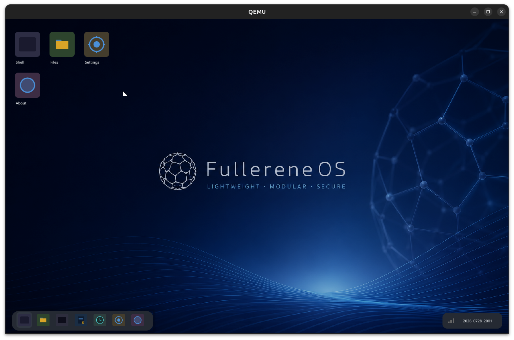

# Fullerene

> A Rust operating system for x86_64 UEFI with a graphical desktop, a multitasking kernel, an interactive shell, and experimental native/Linux application support.



[Development history](docs/history) · [Discord community](https://discord.gg/FfAbRaUA26)

Fullerene is a `no_std` Rust operating system under active development. It boots through UEFI, runs a kernel with process/thread scheduling and system calls, provides a Lattice-based desktop, and exposes a Nozzle shell through both the graphical terminal and the serial console.

The project is developed against QEMU and selected real hardware. Hardware and ABI support is still evolving; see the [support matrix](docs/SUPPORT_MATRIX.md) and [hardware notes](docs/HARDWARE.md) for the current status rather than treating every driver or syscall as production-ready.

## What is implemented

- **Boot and kernel:** Bellows loads the UEFI kernel and framebuffer configuration. Fullerene Kernel owns memory management, interrupts, process and thread lifecycle, scheduling, system calls, the VFS, initramfs, and framebuffer access.
- **Desktop and runtime:** Lattice provides compositing, windows, desktop surfaces, terminal rendering, menus, and wallpaper support. Solvent coordinates runtime services, input, events, frame pacing, windows, file browsing, and viewers.
- **Shell and I/O:** Nozzle provides line editing, history, built-ins, and command dispatch. Carrier defines terminal and pipeline I/O; the shell is available through the GUI terminal and serial output.
- **Filesystems:** Genome provides the VFS abstraction and memory filesystem, with FAT32 and exFAT backends integrated by the kernel.
- **Drivers and networking:** Nitrogen contains the hardware and driver layer, including PCI, APIC/PIC, PS/2, VirtIO, USB, NVMe/AHCI mechanisms, HDA audio, framebuffer, Intel wireless, and related device services. Bonder provides Ethernet, IPv4, UDP, DHCP, WPA, and iwlwifi integration.
- **Userspace and applications:** Fullerene ABI defines the shared syscall contract. Petroleum provides shared bare-metal/syscall utilities, Sealant provides checked memory and MMIO capability types, and Toluene provides the userspace SDK and application binaries. Native ELF, Linux-compatibility, and embedded WASI application paths are present; third-party ports are optional.
- **Shared primitives:** Resonance provides events and dispatch, Chronoline provides timer management, and the `fullerene-kernel/vdso` crate contains VDSO layout helpers. The VDSO page currently exposes read-only time, uptime, and PID metadata.

## Workspace

The repository is a Cargo workspace. Its main architectural crates are:

| Crate | Role |
|---|---|
| `bellows` | UEFI bootloader |
| `fullerene-kernel` | Kernel and hardware-policy integration |
| `flasks` | Build runner, ISO creator, and QEMU launcher |
| `fullerene-abi` / `vdso` | Shared syscall ABI and VDSO helpers |
| `petroleum` / `sealant` | Bare-metal utilities and checked memory capabilities |
| `nitrogen` / `bonder` | Hardware drivers and networking |
| `genome` / `carrier` | Filesystem/VFS and terminal I/O abstractions |
| `lattice` / `solvent` | GUI framework and runtime orchestration |
| `nozzle` / `resonance` / `chronoline` | Shell, event, and timer primitives |
| `toluene` | Userspace SDK and example binaries |

The workspace also contains the `fullerene-tools`, `busybox-build`, and WASI support packages. `toluene/viewer` and `toluene/emulsion` are nested application workspaces built by the kernel build script; vendored sources under `toluene/` are not Fullerene architecture layers.

## Quick start

### Prerequisites

- Rust nightly selected by [`rust-toolchain.toml`](rust-toolchain.toml)
- The `x86_64-unknown-uefi` target and Rust source (installed by the toolchain file)
- The `wasm32-wasip1` target for embedded WASI applications:

  ```bash
  rustup target add --toolchain nightly wasm32-wasip1
  ```

- `qemu-system-x86_64`
- UEFI firmware (OVMF). Bundled firmware is kept in `flasks/ovmf/`; if it is unavailable, install the system OVMF package and run `--clone-ovmf` to copy `/usr/share/OVMF/OVMF_CODE.fd` and `OVMF_VARS.fd` into the project.

Clone submodules when working with optional application ports or the BusyBox integration:

```bash
git submodule update --init --recursive
```

### Build and run in QEMU

The Flasks task runner builds the kernel and bootloader for UEFI, creates `fullerene.iso`, and starts QEMU:

```bash
cargo run -q -p flasks
```

By default, Flasks uses the release profile, 4 GiB of guest memory, VirtIO-GPU at `1920x1080`, SDL display output, and serial logs on stdout.

Useful commands:

```bash
# Use the Bochs-compatible standard VGA device
cargo run -q -p flasks -- --vga std

# Build fullerene.iso without starting QEMU
cargo run -q -p flasks -- --iso-only

# Use unoptimized UEFI artifacts while debugging
cargo run -q -p flasks -- --debug --vga std

# Headless QEMU with serial output only
cargo run -q -p flasks -- --headless --vga none
```

Important Flasks options are `--vga <virtio-gpu|std|qxl|cirrus|none>`, `--display <gtk|sdl|none|curses>`, `--resolution <WxH>`, `--headless`, `--timeout <seconds>`, `--iso-only`, `--debug`, and `--clone-ovmf`. QEMU diagnostics are written to `qemu_log.txt`; set `RUST_LOG=debug` for more verbose task-runner logs.

For prerequisites, manual build steps, application ports, BusyBox, smoke tests, and the complete QEMU option reference, see [docs/BUILD.md](docs/BUILD.md).

## Development

Host checks and tests:

```bash
cargo fmt --all --check
cargo check --workspace --all-targets
cargo test --workspace
```

The CI host job excludes the UEFI-only `bellows` and `fullerene-kernel` packages. To mirror that job locally:

```bash
cargo check --workspace --exclude bellows --exclude fullerene-kernel
cargo test --workspace --exclude bellows --exclude fullerene-kernel
cargo clippy --workspace --exclude bellows --exclude fullerene-kernel --all-targets
```

Build the kernel directly for UEFI with:

```bash
cargo build -Z build-std=core,alloc \
  -p fullerene-kernel --target x86_64-unknown-uefi
```

The kernel build compiles the nested WASI applications. Optional Linux ELF ports are cached when available and are source-built only when explicitly requested:

```bash
FULLERENE_BUILD_PORTS=1 \
  cargo build -p fullerene-kernel --target x86_64-unknown-uefi
```

At runtime, installed packages use the shell commands `app list`, `app install <name> <path-to-elf>`, `app run <name>`, and `app remove <name>`. See [docs/DEVELOPMENT.md](docs/DEVELOPMENT.md) for rendering examples, debugging, and the current architecture notes.

## Documentation

| Document | Description |
|---|---|
| [BUILD.md](docs/BUILD.md) | Prerequisites, builds, QEMU options, ports, BusyBox, and smoke tests |
| [WORKSPACE.md](docs/WORKSPACE.md) | Workspace crates and dependency boundaries |
| [ARCHITECTURE.md](docs/ARCHITECTURE.md) | Current ownership and runtime architecture |
| [DEVELOPMENT.md](docs/DEVELOPMENT.md) | Toolchain, testing, rendering, and debugging |
| [SUPPORT_MATRIX.md](docs/SUPPORT_MATRIX.md) | Current syscall, filesystem, driver, and port status |
| [HARDWARE.md](docs/HARDWARE.md) | Real-hardware compatibility notes |
| [fullerene_todo.md](docs/fullerene_todo.md) | Prioritized development checklist |
| [API documentation](docs/api) | Crate-level API notes |

## Contributing

Bug reports, feature proposals, and pull requests are welcome. See [docs/CONTRIBUTING.md](docs/CONTRIBUTING.md) for the repository workflow and contribution guidelines.

## License

Fullerene is dual-licensed under either of the following, at your option:

- [Apache License 2.0](docs/LICENSE-APACHE)
- [MIT License](docs/LICENSE-MIT)

Unless you explicitly state otherwise, contributions submitted for inclusion in Fullerene are provided under the same dual-license terms.
